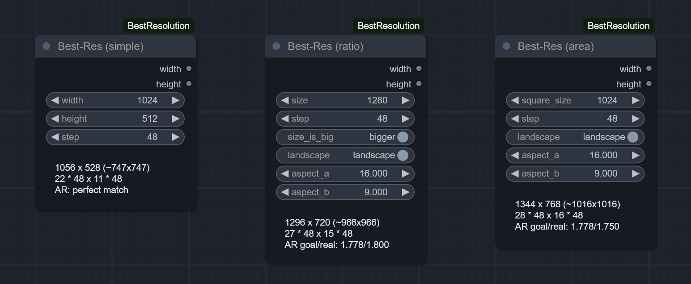

# ComfyUI-BestResolution

QoL Nodes for semi-automatic calculation of the best (most optimal) resolution:
- compatible with ANY model (from now or the future),
- accounting for upscale (**TODO**, planned soon)
- ... and (the required) pixel-step.

In case you didn't know, you can't just choose **any** arbitrary resolution for sampling. You need to ensure:
- both width and height are divisible by pre-defined latent scale factor (8 for both SD1.5 and SDXL);  
- the overall resolution (aka megapixels) is as close to training dataset as possible.

This pack lets you forget about crunching numbers and handles the calculation of optimal width/height for you, while still leaving control to you. It provides 3 main nodes:

### Simple

Just rounds width/height to the given step, ensuring the image **CAN** be converted to latent - both in initial generation and after some upscales.

### From Aspect-Ratio

You specify the desired aspect ratio, one of the sides, and orientation (landscape/portrait). The node detects the actual width/height.

### From Area

To my taste, **THE** safest and easiest approach to selecting the optimal sampling resolution.

All you need to know is a side of square images the model was trained on (512 for SD1.5, 1024 for SDXL). The node handles the rest to ensure the total resolution (i.e., number of pixels) is as close to the training data as possible, while still respecting aspect ratio and step size.

## Tooltips

Each parameter is self-documented in detail - just hover mouse over it. If you're new to Comfy and Stable Diffusion, this might be especially helpful.
