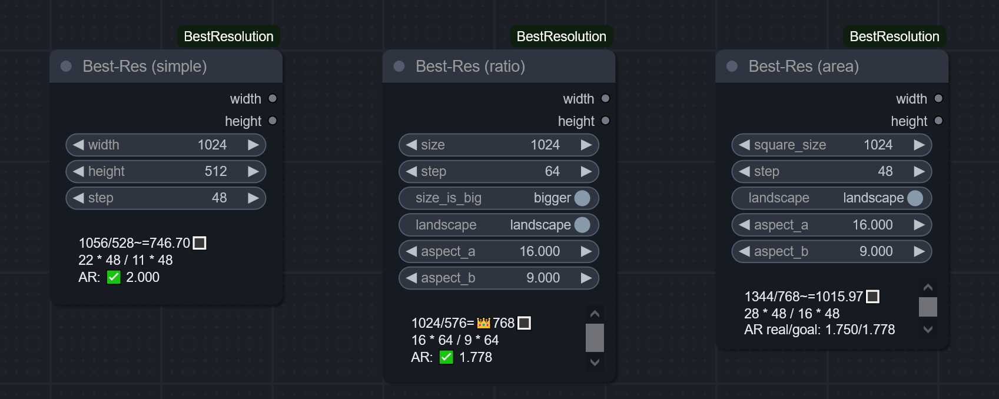

> "Do one thing and do it well." _— Peter H. Salus / Doug McIlroy, [core Unix principle](https://en.wikipedia.org/wiki/Unix_philosophy)_

> "Simple is better than complex." _— Zen of Python_

# ComfyUI-BestResolution

A small modular pack - QoL nodes for semi-automatic calculation of the best (most optimal) sampling resolution:
- ... model-agnostic - i.e., compatible with **ANY** model (from now **or** the future),
- ... accounting for upscale (**TODO**, planned soon)
- ... and for (the essential) pixel-step. 

Read any further only if you feel you need to.

## The purpose

In case you didn't know, you can't just choose **any** arbitrary resolution for sampling. You need to ensure:
- both width and height are divisible by a latent scale factor, pre-defined by a model family _(`8` for both SD1.5 and SDXL)_ - and they **must** remain multiples of it both in initial generation **AND** after further upscales;
- the overall resolution _(aka megapixels, total pixel count)_ is as close as possible to the model's "view window" _(the resolution it was trained on)_ - so if you increase one side of the image, you need to proportionally decrease the other.

... and choosing the right resolution is your responsibility. 🤷🏻‍♂️

This pack lets you forget about crunching numbers and handles the calculation of optimal width/height for you, while still leaving control of the image size/proportions/orientation to you. It provides 3 main nodes:

### Simple

Just rounds width/height to the given step, ensuring the image **CAN** be converted to latent - both in initial generation and after some upscales.

### From Aspect-Ratio

As the name suggests, you control the resolution indirectly - by specifying the desired aspect ratio, one of the sides, and orientation (landscape/portrait).  
The node detects the actual width/height to match those as close as posible.

### From Area

To my taste, **THE** way to select the optimal resolution for diffusion models.

All you need to know is a size (one side) of square images the model was trained on _(512 for SD1.5, 1024 for SDXL)_. The node handles the rest to meet all the restrictions:
- match the total resolution (i.e., image area, number of pixels) as close to the training one as possible,
- ... while still respecting aspect ratio, image orientation and step size.

## Tooltips

Each parameter is self-documented in the shortest possible, yet exhaustive detail - just hover mouse over it. If you're new to Comfy and Stable Diffusion, this might be especially helpful.

## A note on `step` value to choose

This parameter has the highest priority. A desired resolution is slightly tweaked to **always** adhere to it **strictly**. The nodes do their best to match all other criteria, but no matter what, in the end both width and height **must** remain a multiple of this value. This means two things:
1. If you don't plan processing the image with diffusion model but otherwise like these nodes for image-size selection, you can still use them - just set `step` to `1` (effectively disabling any rounding).
2. The right `step` value can single-handedly save you from unnecessary cropping or out-painting later.

> In my workflows, I usually generate images like this:
> - initial draft generation, exactly in the resolution the model was trained on - only composition and overall silhouettes matter here.
> - "HD fix": immediate first 1.5x upscale in latent space, followed by sampling with high denoise (0.5+) - this becomes the actual base image to improve upon.
>   - some tweaking/inpainting is done in this resolution.
> - at least one more upscale, still sampling the whole image at once if GPU has VRAM for that (with a lower denoise, though).
> - subsequent upscales with [USDU](https://github.com/ssitu/ComfyUI_UltimateSDUpscale).

So, this imposes a few restrictions on the initial gen if we want to avoid cropping/outpainting later:
- The initial image must be a multiple of `8`
- After 1.5x upscale it must also be a multiple of `8` - so a +0.5 of size must be divisible by 8, or the initial step must be divisible by `8*2`
- After that 1.5x upscale we get into a territory where the ONLY next upscale we can do is 2x - which at that point might have not enough resolution to safely do so without messing up some details and having to denoise with high value again, losing some aspects of the base image we liked. That's a bummer...
  - HOWEVER, if our initial `step` had another factor integer built into it, we can do a fractional upscale again.
  - That factor could be `2` again... but after some tests I discovered `3` is a better choice. So, our total step needs to be `8*2*3` - then the second upscale could be +1/3 or 1.3333x
- Assuming we do at least one more upscale of 2x somewhere down the road, we can use the fact that we did a 1.5x before - since together they become another multiple of 3, or, in other words, the upscaled image could be divided by 9 on each side.
  - This is not at all necessary for "regular"-sized HD images, but might become handy for later ultra-upscales (6k+) with USDU.

Combining all of the above, our lowest common denominator is `8*2*3`, and assuming we do 1.5x + 2x upscales, it will naturally become divisible by `9` down the road.

**Thus, `48` by default.**

But if you prefer to always upscale by 1.5, you might look into `8*2*2` = `32`.
Or, to allow a few more of 1.5x upscales (or a 1.25x one), or to get the resolution closer to the ones we used to (1080p, 1440p, etc), you might want to increase it by a power of 2, getting `64`, `96`, `128`, `192`, `256`, etc.
